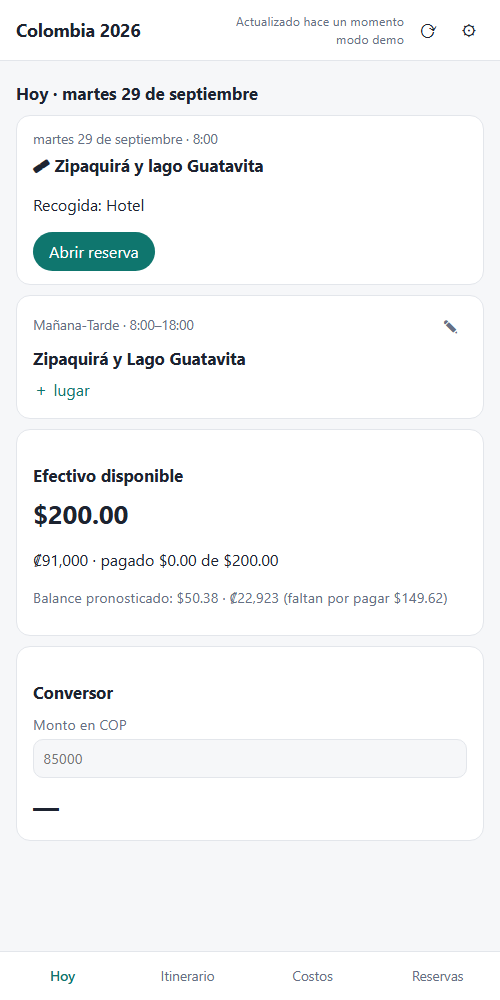
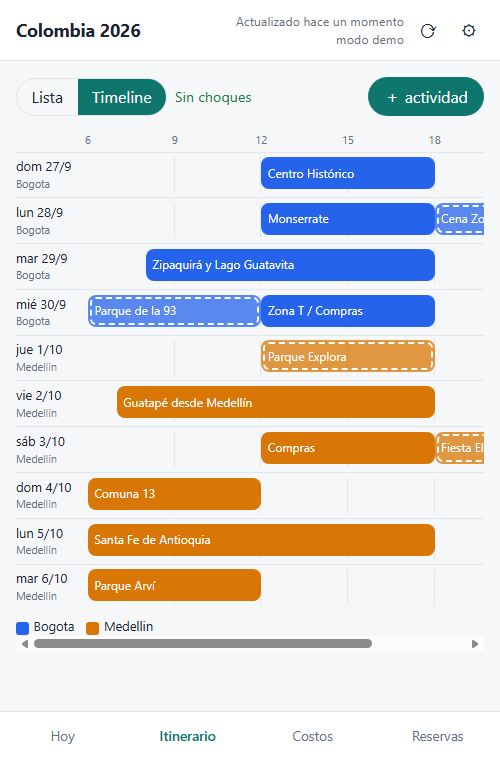
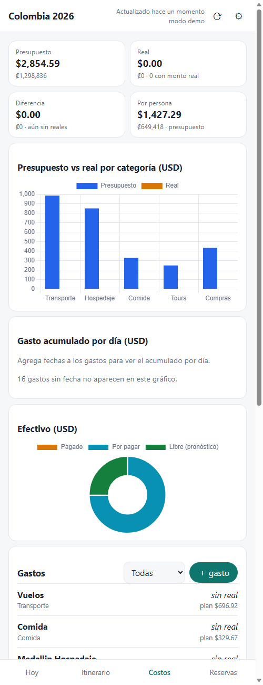
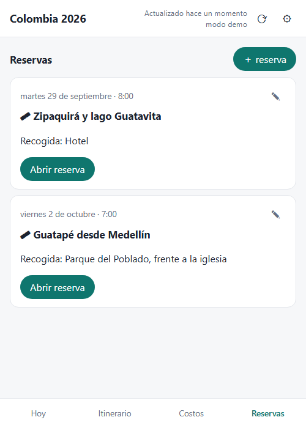
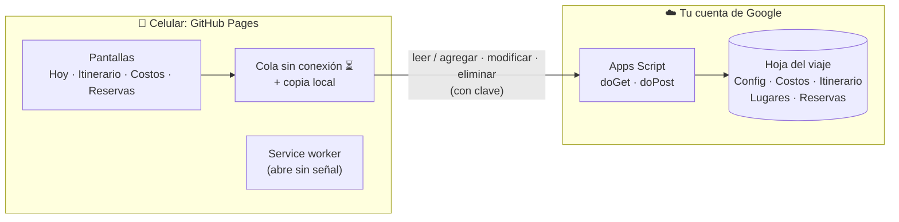

<div align="center">


# Dashboard de Viaje

**Itinerario, costos y reservas de un viaje en el celular: se edita desde la app, funciona sin señal y todo queda guardado en tu propia hoja de Google Sheets.**

[](https://gelizondomora.github.io/dashboard-viaje/)
[](https://gelizondomora.github.io/dashboard-viaje/?demo)


</div>

---

## ✨ Qué hace

<table>
<tr>
<td width="50%" valign="top">

### 📍 Hoy
Las actividades del día, la reserva que toca (con hora y lugar de recogida), el **efectivo disponible** y un **conversor** de moneda local a USD y moneda de casa. Antes del viaje muestra la cuenta regresiva.

### 🗺️ Itinerario
- Vista **Lista** agrupada por ciudad, o **Timeline** con un bloque por actividad.
- **Detección de choques**: avisa si dos actividades se solapan, incluso con horas exactas.
- **Lugares** dentro de cada actividad (por ejemplo, las tiendas de la Zona T), que se marcan ✓ al visitarlos.
- Tocar un espacio libre del timeline crea una actividad en ese día y franja.

</td>
<td width="50%" valign="top">

### 💰 Costos
- **Presupuesto contra gasto real**, en USD y en moneda de casa, total y por persona.
- Gráficos por categoría, gasto acumulado por día y efectivo (pagado, por pagar y libre).
- Registro rápido: tocar un gasto abre el formulario con el campo **Real** primero.

### 🎟️ Reservas
Tarjetas con fecha, hora, recogida y enlace directo a la reserva.

### 📶 Sin señal
Los cambios hechos sin conexión quedan marcados ⏳ y se envían solos al volver la señal, **sin duplicarse**.

</td>
</tr>
</table>

## 📱 Capturas

<p align="center">
  
  
  
  
</p>

<p align="center"><sub>Capturas del <a href="https://gelizondomora.github.io/dashboard-viaje/?demo">modo demo</a>, que funciona con datos de ejemplo en memoria.</sub></p>

## 🧭 Cómo funciona



- **La hoja de Google Sheets es la fuente de verdad.** La app solo lee y escribe en ella, y también puedes editarla a mano.
- **El Apps Script es la única puerta de entrada**, protegida con una clave que se guarda solo en tu teléfono. La hoja no necesita estar publicada.
- **Cada cambio lleva un identificador único**, así que un reintento después de perder la señal nunca crea filas duplicadas.
- **Cada fila tiene un ID estable**: editar o borrar siempre afecta a la fila correcta, aunque reordenes la hoja.

## 🗂️ Estructura de la hoja

| Pestaña | Contenido |
|---|---|
| **Config** | Nombre del viaje, personas, moneda local y de casa, efectivo inicial y tipos de cambio (`USD-CRC`, `COP-CRC`, `COP-USD`…) |
| **Costos** | Detalle, categoría, fecha, si fue en efectivo, **presupuesto** y **real** (en USD o en moneda de casa) |
| **Itinerario** | Fecha, franja (Mañana, Tarde, Noche o Mañana-Tarde), hora inicio y fin opcionales, ciudad, actividad y si es obligatoria u opcional |
| **Lugares** | Sitios dentro de una actividad, con dirección o enlace de Maps, notas y ✓ de hecho |
| **Reservas** | Tour, fecha y hora, recogida, enlace y la actividad del itinerario a la que pertenece |

Las columnas se reconocen **por su nombre**, sin importar mayúsculas ni tildes, así que puedes reordenarlas.

## 🚀 Instalación

<details>
<summary><b>1. Preparar la hoja y el Apps Script</b></summary>

1. En tu hoja: **Extensiones → Apps Script**.
2. Crea tres archivos y pega en cada uno su contenido de [`apps-script/`](apps-script): `Logica.gs`, `PruebasLogica.gs` y `Codigo.gs`.
3. Ejecuta **`probarTodo`**: debe decir `27 ok, 0 fallas`.
4. Ejecuta **`prepararHoja`** una sola vez. Primero crea un respaldo en tu Drive y luego convierte la hoja a la estructura de arriba.

</details>

<details>
<summary><b>2. Clave y despliegue</b></summary>

1. **⚙ Configuración del proyecto → Propiedades del script** → agrega `CLAVE` con un valor largo y aleatorio.
2. **Implementar → Nueva implementación → Aplicación web**, con *Ejecutar como: Yo* y *Acceso: Cualquier usuario*. La clave es lo que protege tus datos.
3. Copia la URL que termina en `/exec`.

</details>

<details>
<summary><b>3. En el celular</b></summary>

1. Abre **https://gelizondomora.github.io/dashboard-viaje/**
2. En **Ajustes**, pega la URL `/exec` y la clave.
3. **Agregar a pantalla de inicio** (Safari: Compartir → Agregar a inicio; Chrome: ⋮ → Agregar a la pantalla principal).

</details>

## 🧪 Desarrollo

Sin frameworks, sin build y sin Node: son ES modules servidos tal cual.

```powershell
# Pruebas: servidor local + Edge headless (Windows)
powershell -NoProfile -ExecutionPolicy Bypass -File tools/navegador.ps1

# Captura de una pantalla en modo demo
powershell -NoProfile -ExecutionPolicy Bypass -File tools/navegador.ps1 -Modo captura -Pagina "index.html?demo&pestana=costos" -Salida costos.png
```

`tests.html` también se puede abrir en cualquier navegador desde un servidor local. Las pruebas de la lógica del servidor (`PruebasLogica.gs`) corren en el navegador y en Apps Script (`probarTodo`).

Parámetros útiles de la app: `?demo` (datos de ejemplo en memoria), `&hoy=2026-09-29` (simula una fecha), `&pestana=itinerario` y `&vista=timeline`.

<details>
<summary><b>Estructura del código</b></summary>

```
apps-script/
  Logica.gs          lógica pura: migración, operaciones, lote idempotente, IDs
  Codigo.gs          conexión con Google Sheets: doGet, doPost, prepararHoja
  PruebasLogica.gs   pruebas + datos de ejemplo
js/
  parse.js           JSON del script → objetos del viaje
  compute.js         totales, efectivo, categorías, "hoy", intervalos y choques
  queue.js           cola sin conexión y sincronización
  api.js · store.js  red con timeout y almacenamiento local
  render-*.js        pantallas · timeline.js · charts.js
  forms.js · editores.js   formularios
  main.js            estado de la app y eventos
sw.js · manifest.json      funcionamiento sin conexión e instalación
docs/superpowers/          diseño (spec) y plan de implementación
```

</details>

## 📄 Licencia

Proyecto personal. Si lo usas para tu viaje, ¡buen viaje! ✈️
